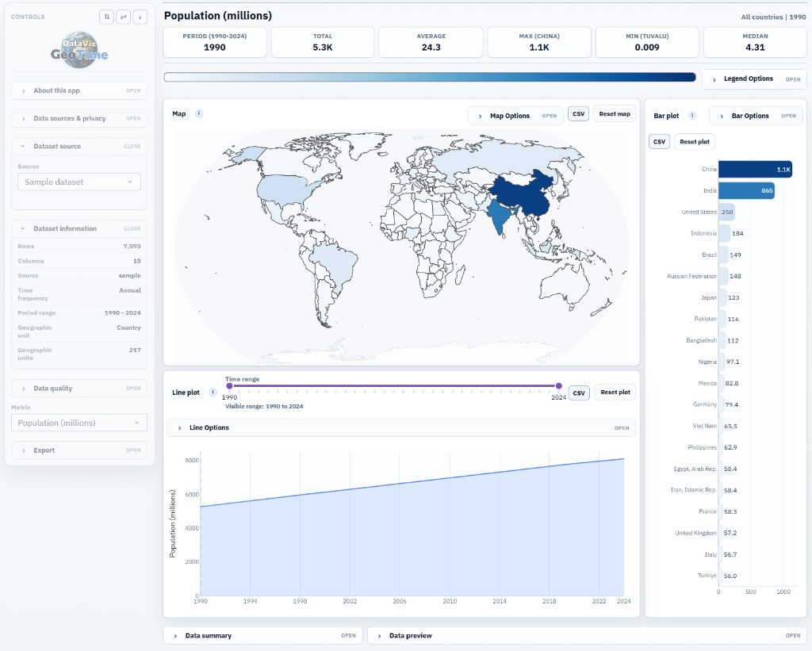
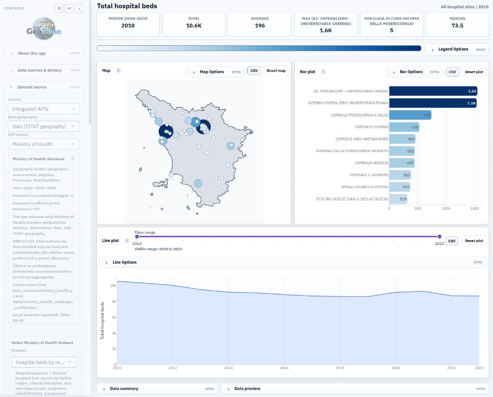
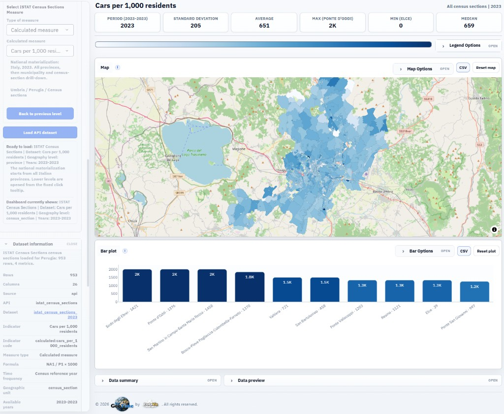
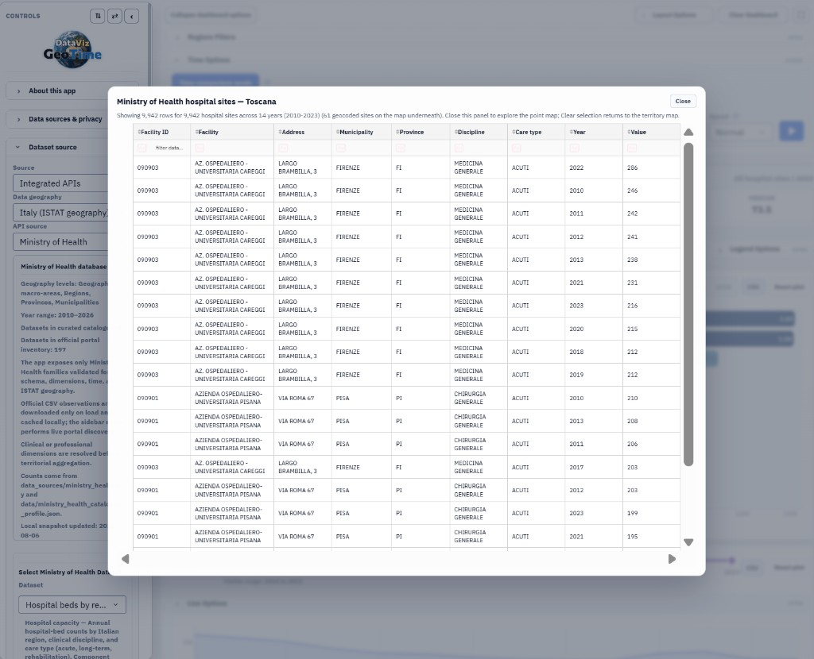
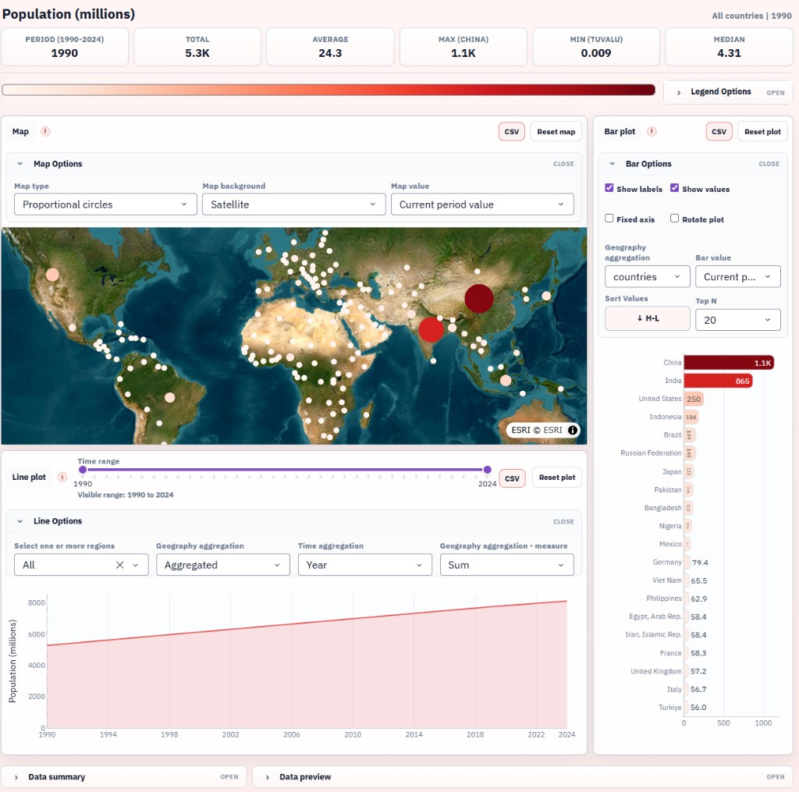
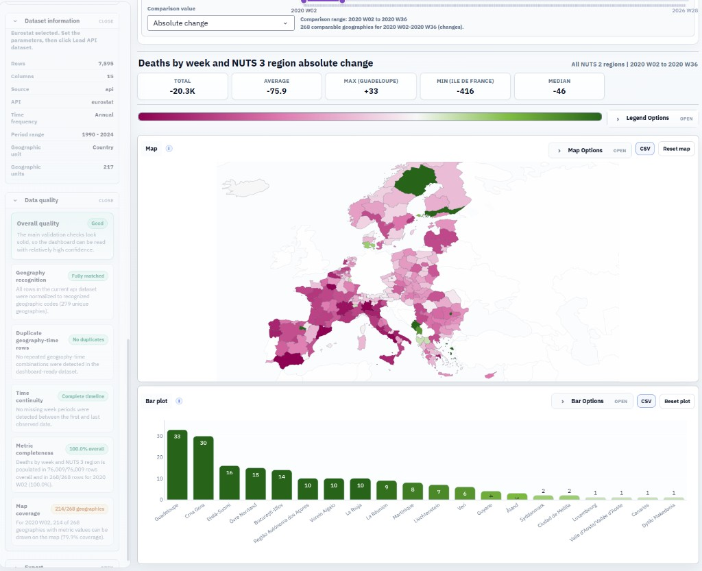
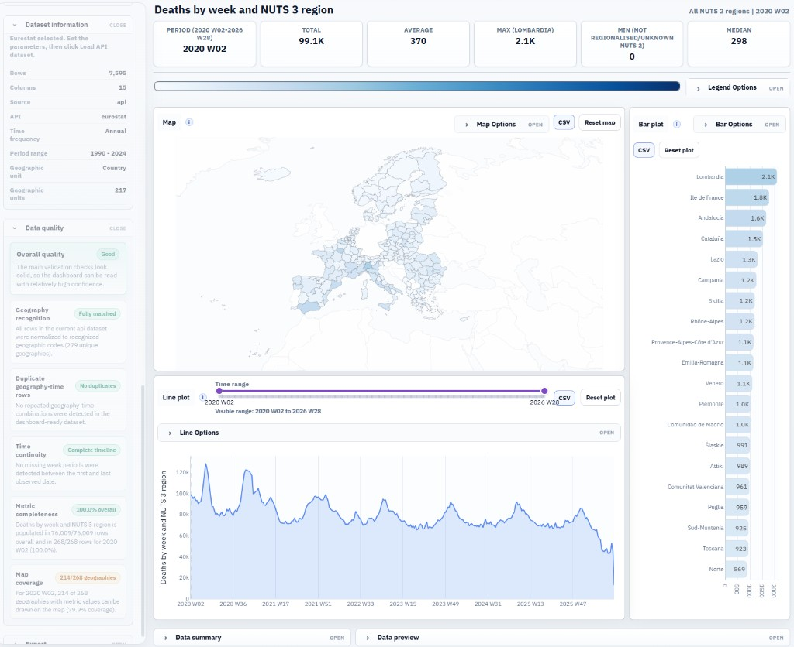
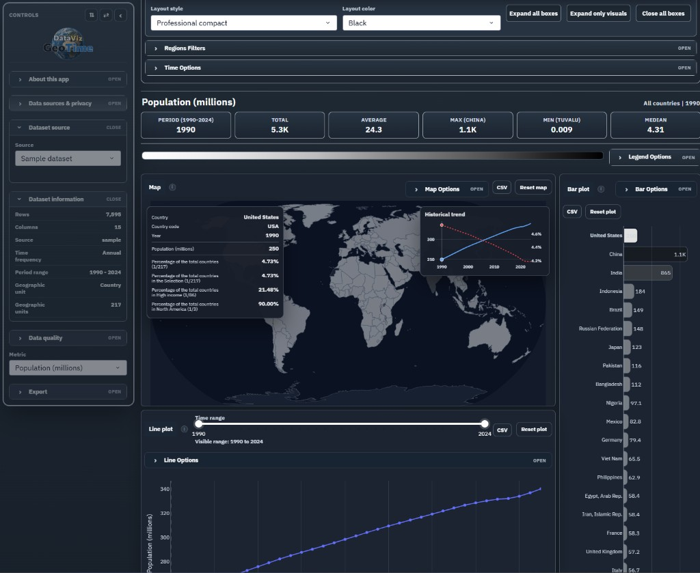

# DataViz GeoTime

**Language:** **English** · [Italiano](README.it.md)

An interactive panel to **explore indicators across space and time**: maps, charts, geography filters, and period-to-period comparison, from open catalogues, your own files, or a sample snapshot.

This repository is a **public showcase** (description and screenshots). It does not contain the application software.

**App:** [geo-analysis.datav1z.com](https://geo-analysis.datav1z.com/)  
**Site:** [datav1z.com](https://datav1z.com/)

---

## Who it is for

DataViz GeoTime is for people who need to **read a territory and a time series together**, without splitting the work across a spreadsheet, a GIS, and disconnected charts.

It is especially useful for:

- analysts and researchers who compare indicators across areas and years;
- anyone working with **Italian and European open data** who wants an immediate map reading;
- newsrooms, research offices, and policy teams who need to **show** a result (change, concentration, outliers) and then download data or a report;
- anyone with their own territorial dataset who wants it in the same visual environment as the built-in catalogues.

It is not an editing GIS, and not a data-science notebook. It is a **reading dashboard**: pick the source, the geography, and the measure, then move through the map, bars, line, and summary indicators.

---

## What you see at a glance

The interface has two areas.

On the **left** (or top/bottom in some layouts) is the **controls** column: catalogue search, source, data geography, dataset, dimensions, years, measure. From here you load the dataset and see whether it is already on the dashboard.

On the **right** is the **dashboard**: context title, actions (layout options, fullscreen, clear), the legend strip, the three main visuals (map, bars, line), and panels for summary, data quality, and a table preview.

The three visuals share selection, highlight, and colour scale. Clicking a territory on the map, hovering a bar, or filtering from the sidebar updates the rest in a consistent way.

---

## Loading data

### Built-in catalogues

From **Dataset source** you can:

- **find a dataset** by title, code, or theme (suggestions after Enter, grouped by source);
- choose the **Italy** or **international** scope;
- select the source and that source’s own filters (territory, dimensions, years, measure);
- load the dataset onto the dashboard.

Search **does not download** data: it pre-fills filters. Download happens on load, with explicit feedback (loading / ready / already loaded).

Catalogue families covered today, as **orientation** only (public names, not a technical inventory):

**Italy** — official and administrative statistics, social security, public finance, environment, education, health, cohesion, elections, and other national open-data banks.

**International** — development indicators, finance, European statistics at several territorial levels, country comparisons, and U.S. demographic and socio-economic data.

On some sources, when a validated formula exists, you can switch from a **published** measure to a **calculated** one in the same context (same territory, same period), without leaving the dashboard.

### Your files and saved projects

Besides catalogues you can:

- **upload** a territorial/temporal file through a guided flow (recognition of time, geography, and measure columns);
- **reopen a project** or a saved configuration, to restore filters, layout, and the starting dataset.

File formats, schemas, and integration details are not documented here: this page describes the experience, not how to rebuild the runtime.

---

## Geography: from the world to a point

The dashboard matches the map to the dataset’s **territorial level**: countries, European regions, provinces, municipalities, census sections, point facilities, and similar extra-EU levels when the source provides them.

You can:

- filter or **highlight** territorial groups (macro-regions, regions, source groupings);
- select individual territories from the map, bars, or a list;
- aggregate bars to a higher level (e.g. municipality to region) and choose how the measure is aggregated;
- in some contexts, **drill down** into a site or facility (detail table, circles on the map).

Filter and highlight are different: filter narrows the analytical perimeter; highlight keeps everything visible and underlines the selection.

---

## The three visuals

### Map

The map is the centrepiece. Values can be shown as:

- a **choropleth** (filled areas);
- **proportional circles** (useful for points, facilities, or when filled areas are hard to read);
- combinations with a classic or satellite **basemap**, projection, and framing.

You can fit the view to the selection, reset it, and open map options (type, background, value mode). On fine-scale Italian datasets the map can expand to give the territory more room.

On phones and tablets, **plot zoom and box-select** are turned off so scrolling the page does not crop the view; click and hover remain. On desktop, zoom and analysis gestures stay available.

### Bars

The bar chart compares territories (or aggregated groups) on the current measure. You can:

- sort and keep the top N;
- rotate orientation;
- lock the axis during time animation;
- show labels and values;
- keep colours on the same scale as the map.

### Line (or bars over time)

The temporal visual shows how the measure moves. You can compare territories, totals, and aggregates, and — when the dataset is a true series — animate or step through time. In **time comparison** the line is hidden: the story is the change between two periods, not the year-by-year level.

---

## Time: one year, two periods, the full series

Time is a first-class axis, not a secondary filter.

- **Current period** — slider or year (or period) choice for the map and bars; KPIs and the line stay anchored to the series.
- **Animation step** — advance by year or by wider aggregates, with play and speed.
- **Time comparison** — pick two endpoints (often first and last available year, or any pair in the series). Map and bars show the **change** (absolute or percent), with a diverging scale centred on zero.

In comparison mode the **legend** has two scopes:

- **Relative** — colours scaled on the comparison you are looking at;
- **Absolute** — extremes **fixed on the full historical series** of possible comparisons, so changing years keeps colours comparable and does not retune the scale on every slider move.

---

## Colour and legend

The strip under the dashboard actions is the **shared legend** for map and bars.

You can choose:

- **continuous** or **discrete** scale;
- a classification method (equal intervals, quantiles, natural breaks, log, extreme tails, diverging around zero, …);
- automatic or manual palette, with reverse;
- **absolute / relative** scope (levels over time, or changes in comparison).

Hovering the legend can highlight territories in that class. The marker on the colour bar follows the value under the pointer.

---

## KPIs, quality, and tables

Around the visuals there are context panels:

- **KPIs** — summary of the visible perimeter (total, extremes, distribution). With a single territory selected, time comparison can follow that area’s year-by-year path.
- **Data quality** — coverage, gaps, territories that are or are not comparable across two periods.
- **Preview** — table of the current frame, with export.
- **Tooltip** — on map hover: name, code, value, and on desktop a small historical trend (hidden on phone and tablet so it does not cover the map).

---

## Layout, language, themes

- Page **style and colour** (light themes and dark).
- Interface **language** (at least Italian and English), switched from the sidebar.
- Dashboard **fullscreen** (on touch devices, a mode that does not break menus).
- **Collapsible sidebar**: on narrow screens, language / reopen controls stay in the actions row, without leaving an empty strip.
- **Phone portrait** — compact layout; **landscape** — same logic as the tablet view (sidebar and dashboard side by side).
- Dataset-source dropdowns **stay inside the column**, instead of overflowing the panel.

---

## Export and share

From the dashboard you can take the work with you, without rebuilding filters by hand:

- data for the filtered perimeter;
- data behind the map, bars, or line;
- a **screenshot** of the view;
- a **project / configuration** to reopen the same setup;
- a summary **report** for an external reading.

The app is also meant to be **embedded on the DataViz site** and hosted as a service, not only as a local session.

---

## What this page is not

It is not an install manual, and it does not list dependencies, ports, environment variables, file schemas, or replication steps.  
The software stays outside this repository. To **use** the application: [geo-analysis.datav1z.com](https://geo-analysis.datav1z.com/).

---

## Screenshots

| View | File |
|------|------|
| Sample dashboard (world population) | `docs/images/hero-dashboard.png` |
| Italy — hospital beds, proportional circles | `docs/images/italy-hospital-beds.png` |
| Italy — census sections | `docs/images/italy-census-sections.png` |
| Facility drill-down table | `docs/images/italy-facility-table.png` |
| International — Eurostat NUTS | `docs/images/international-eurostat.png` |
| Time comparison | `docs/images/time-comparison.png` |
| Dark theme and tooltip | `docs/images/dark-theme.png` |
| Map options, circles, satellite | `docs/images/map-options-circles.png` |

---

## Credits

**DataViz GeoTime** — [datav1z.com](https://datav1z.com/)  
Datasets remain owned by and licensed under their respective public sources; the application presents them in a single visual environment.
